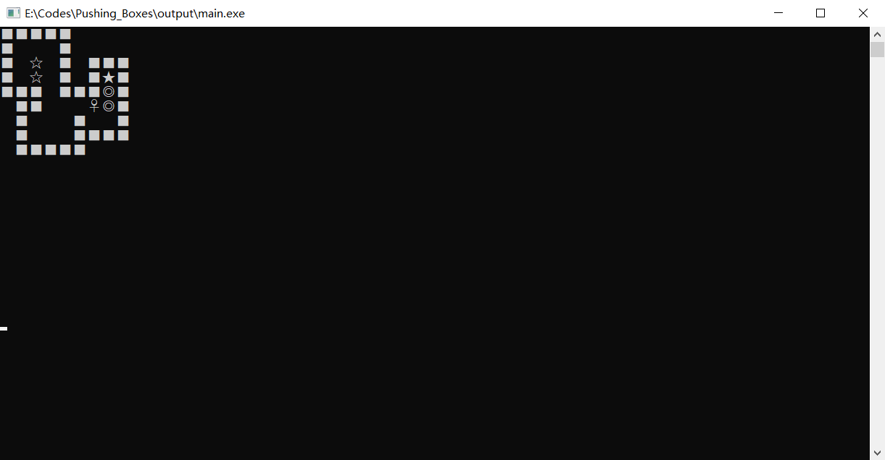

# 程序说明

## 1. 开发环境

本程序在Windows 10 环境下开发的，开发工具为VSCode。

**编译环境**：`gcc 8.1.0`

**调试环境**：`gdb 8.1`

**如何编译本程序**：将本程序克隆到`Windows`系统中的一个文件夹，在文件路径打开`cmd`或者`powershell`，输入`mingw32-make`即可开始编译，输入`mingw32-make clean`即可清除编译产生的目标文件和二进制文件

如果你想使用VSCode对本程序进行二次开发，且你已经使用VSCode搭建好了C/C++开发环境，那么可以直接使用VSCode打开程序文件夹，按`F5`(或`Fn+F5`)即可开始调试。

## 2. 程序说明

本程序为推箱子小游戏，打开程序后按照程序指示即可进行游戏

本程序的输入输出为`GBK`编码。如果您发现在运行时程序乱码，大概率是因为您的终端的编码不是**GBK**。

## 3. 程序运行快照

